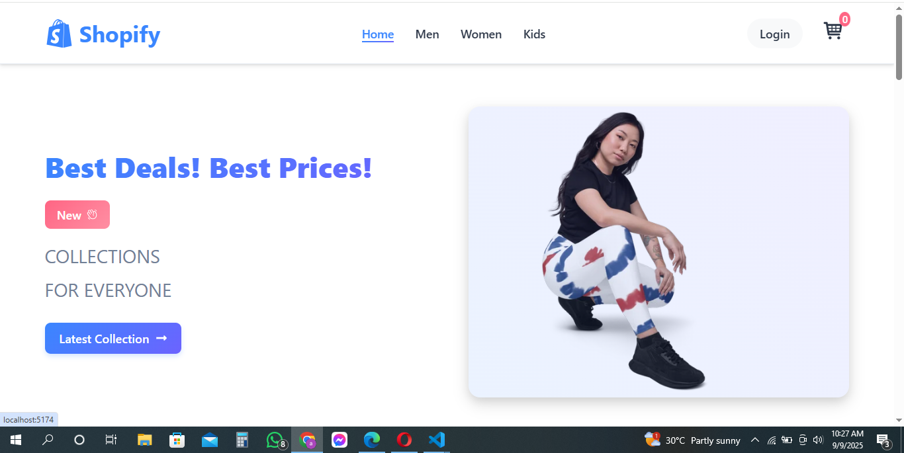

# Shopify E-Commerce Website

A modern, responsive e-commerce website built with React.js, featuring a clean UI with light and dark mode support.

## 🚀 Features

- **Product Catalog** - Browse products by categories (Men, Women, Kids)
- **Shopping Cart** - Add/remove items with persistent cart state
- **User Authentication** - Login/Signup functionality
- **Responsive Design** - Optimized for desktop and mobile devices
- **Dark/Light Mode** - Automatic theme detection based on system preferences
- **Newsletter Subscription** - Stay updated with latest offers

## 🛠️ Tech Stack

- **Frontend**: React.js, React Router
- **Styling**: CSS3 with Variables, CSS Grid, Flexbox
- **Icons**: React Icons
- **State Management**: React Context API

## 📸 Screenshots

### Desktop View (Light Mode)


### Mobile View (Dark Mode)  


## 🚦 Getting Started

### Installation

1. Clone the repository
```bash
git clone https://github.com/Qasim-asb/E-Commerce-React.git
cd E-Commerce-React